# Zkouška

## Událost & Incident

- **Event** = pozorovatelný výskyt v systému nebo síti

- **Adverse events** = události s negativními důsledky

- **A computer security incident** = narušení, nebo hrozba narušení politik
počítačové bezpečnosti

- **Risk** = threat * vulnerability

- **Risk management** = eliminace hrozeb za rozumnou cenu

- Risk mitigation examples:

  - Compartmentalize
  
  - Secure Fail

  - Defense-in-Depth

  - Least privilege
  
  - Security-by-Obscurity

- **Security incident** = člověkem způsobená událost s úmyslem způsobit škodu za použití počítače

- Security Incident != Operations incident (different objectives)

- Cil bezpecnosti je branit: Confidentiality + Integrity + Availability

- **Attack vector** = popisuje jak je útok veden a co zneužívá

- **Indicator of compromise** = forenzní důkazy vniknutí do systému

- **Vulnerability assessment** = Použití automatizovaných nástrojů na hledání zranitelností v síti

- **Penetration test** = Identifikování zranitelností a pokus o jejich zneužití

- **Red team assessment** = otestování detection and response mechanizmů a procesů společnosti

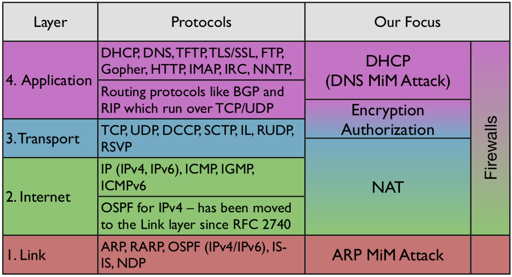

## DHCP

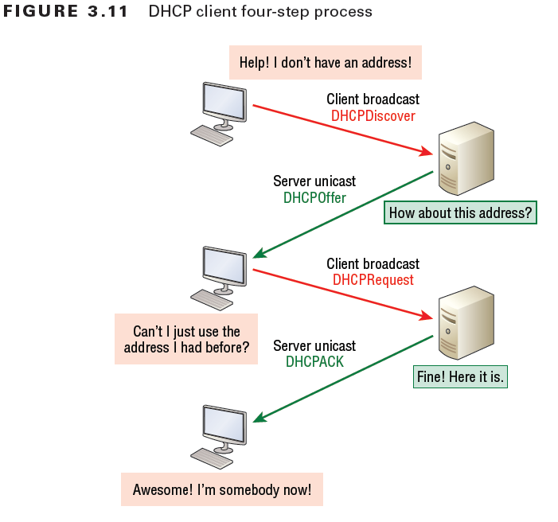

### Attacks

- [Rogue DHCP](https://documentation.meraki.com/MX/DHCP/Tracking_Down_Rogue_DHCP_Servers)

- [DHCP Starvation](https://github.com/kamorin/DHCPig)

## Firewall

- Packet filters - sada pravidel aplikovná na každý paket

- Stateful filter - je schopný rozhodovat na základě stavu seance (TCP sequence number)

- Aplication layer - rozumí obsahu paketů (FTP, DNS, web)

- NAT - basic firewall protection

- Port-knocking = port se jeví jako zavřený dokud na něj nepřijde utajená předem definovaná sekvence paketů

- Black/Grey/White listing podezřelých/známých zdrojových adres (hostů)

## Botnet

- Nakažené zařízení spolupracují a synchronizují se pomocí C&C, IRC, HTTP, DNS, P2P ...

## Klasifikace útoků

- Klasifikace podle:
  
  - Vektoru útoku
  
  - Cíle útoku
  
  - Zranitelnosti a použitého exploitu

- [Mitre kategorie](https://attack.mitre.org/)

- Typy útoků

  - Information Gathering

  - Credential Stealing

  - Communication intercept

  - Service/operation disruption

  - Data Exfiltration

- Obrana

  - Access Control

  - Authentication

  - Confidentiality

  - Integrity

  - Non-repudiation

## Observation and Monitoring

- Host-Based (system logs, audit tools) / Network-Based (network monitoring)

- Active (ping, iperf, Altas RIPE, PerfSonar) / Passive

- Monitoring: Počet paketů / Raw data (Deep packet inspection) / Flow

## Network Scanning

- Host / Service discovery

- Information gathering

- UDP / TCP (one src IP, one dst IP, many dst ports)

- ICMP (one src IP, many dst IP)

## DoS

- Způsobí zpomalení nebo výpadek poskytované služby

- Fork bomba, XML expansion, Consuming verification, Regular expresisons, large zip archives

- DDoS = Distribuovaný DoS, primární oběť (služba na kterou se útočí) a sekundární oběť (boti)

- [SYN Flood](https://github.com/Psendas/SIB-tutorials/blob/main/tutorial-2/vagrant/notes.md#syn-flood)

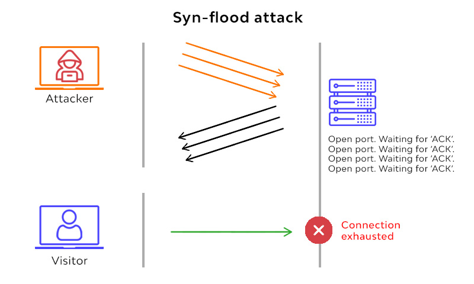

- Application layer - flooding, DRDoS (R=reflected/[amplifikace](https://github.com/Psendas/SIB-tutorials/blob/main/tutorial-2/vagrant/notes.md#dns-amplifikace)), Fragmented low rate, small window, malformed request

## Brute-Force attack

- Guessing password / hosts

- Dictionary enumeration

## Defence

### Scanning Defense

- Otevřít pouze nutné porty

- Drop instead of Reject

- Decoy/Honeypot

### SYN Flood Defense

- SYN cookies

- Selectively dropping connections

- Reduce timeout

### Smurf ICMP Defense

- drop ICMP

### DoS Defense

- ISP countermeasures

- SYN proxy

- Limity připojení (Rate-limiting)

- Load balancing (CloudFlare, Google Shield)

- Remotely Triggered Blackholing = blokace útoku na straně IPS útočníka

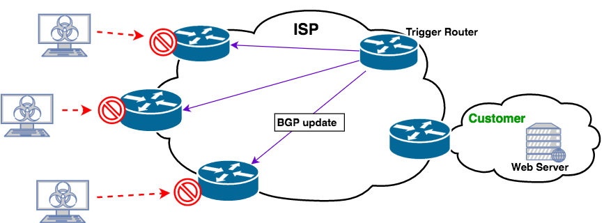

### Brute-force Defense

- Omezit počet pokusů

- Silná hesla, nebo klíče

- Použití nepredikovatelných hodnot (názvů)

- [Fail2ban](https://en.wikipedia.org/wiki/Fail2ban) software

### Covert channels

- Odesílání dat skrytě prostředky, původně určenými pro jiný účel

- Inside ICMP payload

- Inside DNS record information

- Obojí je možné detekovat větším množstvím paketů

## MitM

- Možné na: AP, DHCP, [ARP](https://github.com/Psendas/SIB-tutorials/blob/main/tutorial-1/vagrant/notes.md#manu%C3%A1ln%C3%AD-pou%C5%BEit%C3%AD-scapy-pro-arp-spoofing), DNS, BGP, Session hijacking, NTP

- Protocol Downgrade: BEAST, BREACH, CRIME, Heartbleed, POODLE

- [MitM examples github](https://github.com/frostbits-security/MITM-cheatsheet)

## Remote access

- **GRE** = Generic Routing Encapsulaiton - přidává vlastní hlavičku (protokol number 47) (Cisco site-2-site VPN)

- **L2TP** = Layer-2 Transport Protocol - point-2-point UDP spojení (port 1701) (Windows, Mac, iOS, Android)

- **IPSec**

  - Dvě strany komunikace ustanový klíče pomocí IKE protokolu
  
  - **AH** = Authentication header - authentication -> Paket nebyl modifikován, je "čerstvý" (not replayed) a opravdu pochází od protistrany, která ustanovila klíč

  - **ESP** = Encapsulated Security Protocol - authentication + __encryption__

  - **Transport Mode** - šifrovaný a autentizovaný L4-L7 provoz - IP hlavička nešifrovaná, může a nemusí být autentizovaná, šetří se šířka přenosového pásma

  - **Tunnel mode** - chrání obsah __i__ IP hlavičku (L3-L7), delší pakety a pokud je použito šifrování i obtížnější analýza provozu

- **SSL VPN** - Portál na přístup k zdrojům skrz webové rozhraní (Email, Intranet, Fileshare), vše v browseru, HTTPS, web authentication

- **OpenVPN** - Založeno na OpenSSL, UDP/TCP, TUN (od L3) a TAP (od L2)

- **Tunneling** - [`stunnel`](https://en.wikipedia.org/wiki/Stunnel), [`socks`](https://en.wikipedia.org/wiki/SOCKS), [`socat`](http://www.dest-unreach.org/socat/), `ssh`

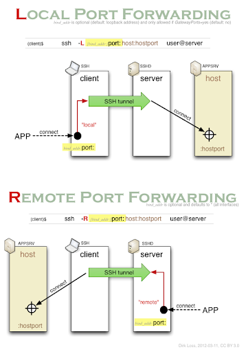

- **RADIUS**
  
  - Single user databse, authentication, authorization, accounting

  - Access-Request not authenticated -> MITM possible, access request forgery possible

  - Shared secret attacks, Offline dictionary attacks, PRNG attacks

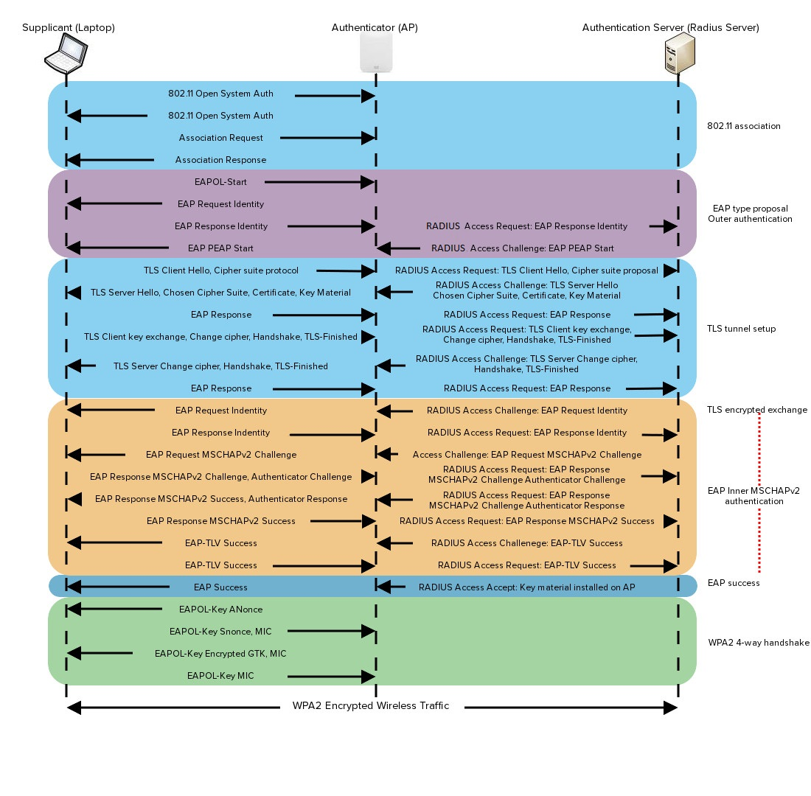

## Active Defence

- Útočné techniky použité pro obrané účely (pasti připravené na útočníky)

- Cyber Deception = snaha útočníka cíleně zmást a zpomalit pro zlepšení obrany (více času na reakci)

- Protiútok je legální riziko, potřeba dobře označit a konzultovat

- **Annoyance** - zpomalit útočníka

  - Filtrovat cokoli co identifikuje názvy a verze serveru/softwaru

  - Změnit TCP/IP stack (zmate automatické detekce OS/verzí)

  - Náhodné/rekurzivní linky pro zmatení automatizovaných web crawlerů/spiderů

  - Honeypot = zranitelný stroj se spoustou otevřených portů, bez důležitých dat, zároveň může reportovat aktivitu útočníka

    - **Entrapmenet** = přesvědčíme útočníka dělat nelegální věci, které by jinak nedělal (nelegální)

    - **Enticement** = útočník páchá nelegální činnost, kterou by ale páchal i tak -> honeypot (legální)

- **Attribuion** - identifikace útočníka

  - [Google](https://google.com), [Shodan](https://shodan.io), [Censys](https://censys.io)

  - DNS lookup (`dig`)

  - Port/vulnerability scans (`nmap`, `wpsnac`)

  - Credentials, geotagged media

  - Připojení přes proxy => využít aplikace, která nepoužívá proxy na straně útočníka, případně nějaký bug

- **Attack** - spuštění kódu na systému útočníka

  - Potřeba právní a manažerské konzultace a varování útočníka že todlecto se nedělá, páč útočník má taky svoje práva ( ͡~ ͜ʖ ͡°)

  - Útočíme Java Scriptem, Makrem v dokumentu spouštěným na počítači útočníka

## Data Mining

- Sledování vzorců útoku místo přesného porovnání s otiskem předchozích útoků

- Detekce:

  - Zneužití
  
    - složité vyhodnocení

    - detekce již známých útoků
  
  - Anomálií
  
    - porovnání s automaticky vytvořenými vzorci běžného provozu

    - nezvyklý provoz => nový útok / podezřelý uživatel

    - potenciálně spousta false alarmů

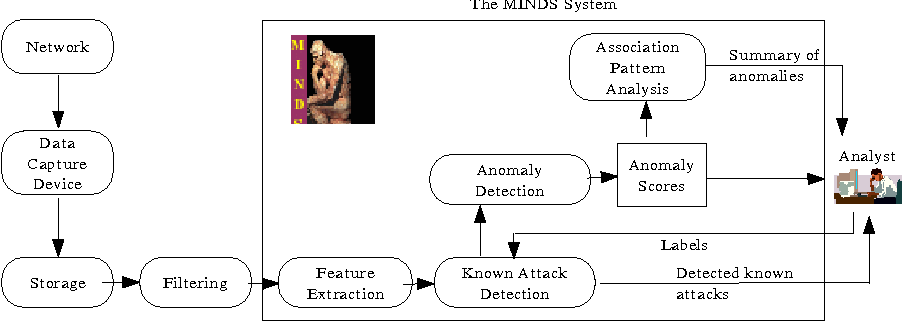

## Intrusion Detection

- TODO prednaska 8 a 9

## Incident Response

0. Připravit si předem postup řešení incidentu

    - Politika odpovědi na incidnet - nahlašování (managementu, třetím stranám, ...)

    - Zálohy (dat i HW zařízení) a forenzní stanice

    - Dokumentace zdrojů (topologie sítě, kritické aspekty)

    - Prevence - zabezpečení sítě, koncových zařízení a vzdělání uživatelů

    - Incident response team - pověření jedinci s autoritou jednat v případě incidentu (interní nebo outsorsovaný)

    - Coordination team - radí ve spolupráci více týmů, bez autority jednat

1. Potvrdit jestli se nejedná o false positive

    - Vektory útoku

      - Removable media

      - Socia engeneering - email/phising, web

      - Brute force attacks

      - Impersonation

      - Improper usage

      - Ztráta/krádež zařízení

      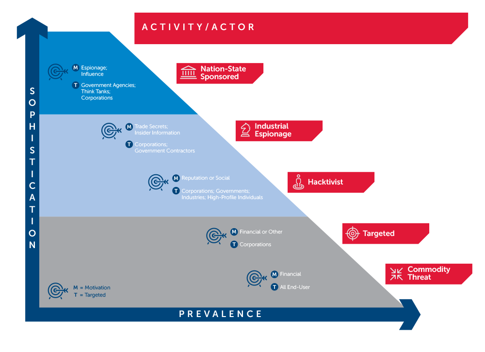

    - Detekce

      - Monitoring (real-time alerts)

      - Uživatelé nahlásí phising

      - IT admin postřehne podezřelé chování

      - Nahlášení od třetí strany

    - Dwell time = čas od prvního důkazu, že došlo ke kompromitaci do detekce incidentu (global median is around 100+ days!!!)

2. Izolovat hrozbu

3. Zjistit a zdokumentovat rozsah

    - **SIEM** = Security Information and Event Management

      - Shromažďuje logy a hledá anomálie nebo podezřelé vzorce indikující narušení bezpečnosti

      - Collection => Parsing => Normalisation (redukce běžných událostí) => Enrichment (Přidání užitečných dat - geolokace, čísla transkací, DNS jména) => Correlation (IDS, množství paketů, chybné pokusy o přihlášení) => Logging

4. Minimalizovat narušení provozu a škody

5. Obnovit provoz

6. Umožnit vyšetřování

    - Má za cíl získat důkazy pro právní vyšetřování ne zajistit opětovný bezpečný provoz

    - Důležité je počítat hashe a uchovat přesnou nezměněnou kopii stavu (write blockers)

    - Chain of evidence - detailní sled událostí včetně identifikátorů, jmen, adres, času, lokace, atd

    - Získat - obsah paměti, disku, síťový provoz

    - Hledat - běžící procesy, služby a programy (autorun, scheduled), historii uživatele, informace o síťovém připojení, ovladače a moduly, instalovaný software, logy, souborový systém, otevřené soubory

    - Malware zkoumat v odříznutým virtuálu, revertovat stav, nenechávat lehce spustitelný (změnit příponu, heslovaný archív)

7. Vzdělat management

8. Vylepšit bezpečnostní postupy do budoucna

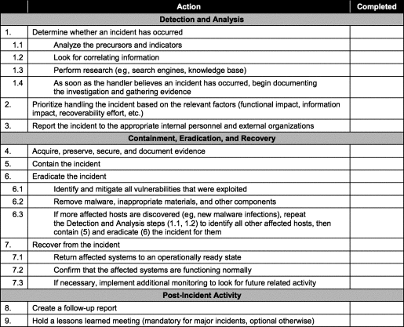

- Spolupráce na obraně - sdílení poznatků o oncidentech STIX a TAXII

## Penetration Testing

### Fáze

1. Pre-engagement - Definice rosahu, cíle, času, schvávení a povolení testu

2. Information Gathering - Pasivní (OSINT, sniffing) / Aktivní (Social engineering, scanning)

3. Threat Modeling - Modelování scénářů jako útočník

4. Vulnerability Analysis - Skenování zranitelností (Qualys, Nessus, OpenVAS)

5. Exploitation - Spouštění exploitů ve snaze získat přístup k cílovému zařízení

6. Post-exploitation - Získání informací ze systému, eskalace oprávnění

7. Reporting - Výsledná zpráva s detaily testu

- Testy se dělí podle:

  - Znalosti testovaného systému na Black/Gray/White box

  - Úrovně přístupu k testované infrastruktuře - externí / interní

- Přístupové body:

  - Remote Network - přístup přes internet, útok na vnější infrastrukturu (FW, web, SMTP, DNS, ...)

  - Local Network - simuluje útočníka s fyzickým přístupem do interní sítě

- Reconaissance = vyhledávání informací o cíly testu, účelem je získat přehled o cílové infrastruktuře (IP adresy a používaný SW, případně i jeho verze a komponenty)

- Pasivní zdroje informací:

  - Web servery nejen cíle (Finanční, Pracovní stránky, Tiskové zprávy, ...)

  - `whois`

  - Vyhledávače a webarchivy (Google-Fu)

  - Google Earth

  - Stránky zaměstnanců ([Linkedin](https://linkedin.com), [Facebook](https://facebook.com))

  - Dumpster diving, shoulder surfing, eavesdropping

  

  - Social engineering

- Aktivní skenování:

  - Skenování aktivních zažízení v IP rozsahu získaném pasivním sběrem informací (případně zadaném zákazníkem)

  - Port scan otevřených portů na aktivních zařízeních za účelem detekce služby (případně její verze) provozované na daných portech

  - Může být detekováno a jako součást obrany blokován další provoz

  - Síť může blokovat ping odpovědi, útočník může při dalším skenování považovat všechny adresy v rozsahu za aktivní a skenovat vše

  - TCP scan
  
  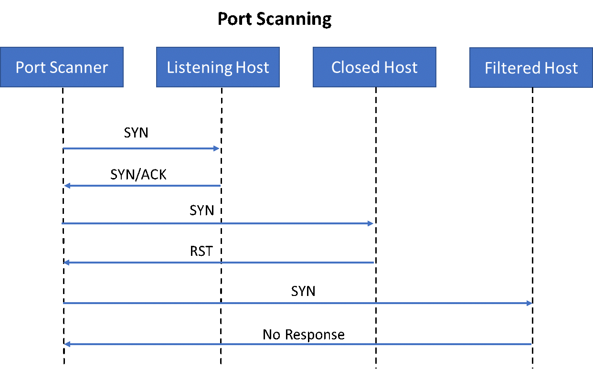

  - UDP scan

    - Odpověď od očekávané služby na daném portu = open

    - Bez odpovědi = open/filtered

    - Odpověď ICMP unreachable = closed

  - Banner Grabbing = rozpoznání služby (případně i její verze) podle banneru odesílaném službou po navázání spojení

  - OS Fingerprinting = odhadování verze systému na zákledě odlišností odpovědí způsobených rozdílnout implementací TCP stacku, případně sniffováním v síti

- Vulnerability scanning

  - Vulnerability = slabina v softwaru nebo jeho konfiguraci, kterou je možné zneužít

  - Vulnerability scanners (Qualys, Nessus) zjišťují:

    - Jesli je host spuštěný

    - Použití Firewallu

    - otevřené TCP/UDP porty a služby na nich provozované

    - použitý OS

    - Zranitelnosti na základě detekovaných služeb ([Expolopit-DB](https://exploit-db.com))

- STRIDE Threat Modeling

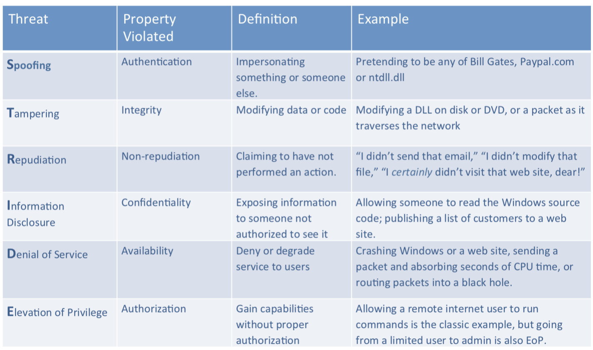

- Exploitation = získání přístupu k systému překonáním bezpečnostních omezení

  - Protiopatření: Host Based Intrusion Prevention System, Security Guard, Web Application Firewall, ...

  - `metaspoit`

  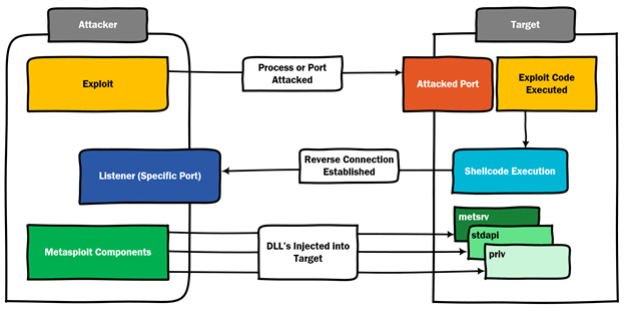

  - Password Attacks
  
    - Online (systém ověřuje útočníkem zaslané heslo) / Offline (lámání získaného hashe)

    - Rainbow tables = tabulky s předpočítanými hashy řetězců, urychlují útok na nesolené hashe hesel

  - Fuzzing = automatizované testování různých vstupů software s cílem odhalit neočekávané chování

- Post Exploitation

  - Sestavení přehledu o částech systému dostupných útočníkovi (k jak ceným datům máme přístup)

  - Instalovaný software, běžící služby, síťová konfigurace, prohledání citlivých dat, konfigurace systému, přístupné soubory

  - Persistence = zajištění přístupu na napadený systém, pomocí nového účtu, SSH klíče, skriptu s reverse shellem... (ideál je snadný přístup skrz případný firewall i po rebootu zařízení)

  - Lateral Movement = získání přístupu k dalším zařízením v síti

  - Cleanup = odstranění všech exploitů, vrácení konfigurtace do původního nastavení, smazaní případně vytvořených účtů
